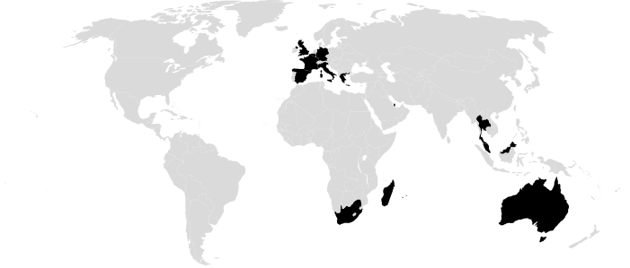

[]()

[](https://www.linkedin.com/in/matthieu-prezut-88ab9b171/) [](https://wa.me/+33622176238?text=I'm%20open%20for%20internship)  [](https://mail.google.com/mail/?view=cm&fs=1&to=matthieu.prezut@gmail.com&su=To%20know%20you%20better&body=Hello%20There)  [](https://badges.pufler.dev?style=for-the-badge)

### Hello there 👋

My name is Matthieu **PREZUT**
I am a **Dynamic** student finalizing an Engineering degrees in computer sciences, looking for a **3 or 4 months internship** in a **Cybersecurity** related field from **June 2021 ⮕ October 2021**.


- 📊 I’m currently working on my data visualization skills

## This week activity

<details>
<summary>Wakatime Stats</summary>

[](https://github.com/anuraghazra/github-readme-stats)

</details>


## My code skills 

<p>
  
   
   
  
   
   
   
   
  
    
   
   
   
   
   
   

  
</p>

[](https://github.com/anuraghazra/github-readme-stats)


## Projects

<p>

 
</p>

[](https://github.com/TibRib/the-cap) ```the-CAP``` the **Comment-Analyze-Predict** sport Bot


[](https://github.com/GBernard314/cronogram) ```cronogram``` the *Telegramic* **cron job notifier**

[](https://github.com/GBernard314/decibel_dB) ```decibel-dB``` the lightweight **DataBase Management System**


---

## My human skills

<p>
	
	 
    - Native language (there is always room for improvement) <br>
  	
	
    - Profficiency level ( Cambridge Assessment )<br>
  	
	 
    - Light conversation B1 level<br>
</p> 

- **Sports** lover 🏸🥋🏊‍♂️🏇⛷️ and **Bodybuilding** adept 🏋️

- **Video Games** lover 🎮

- **Team sport** enthusiast : winning as a team is much more **gratifying** than winning alone

## Currently visited countries



